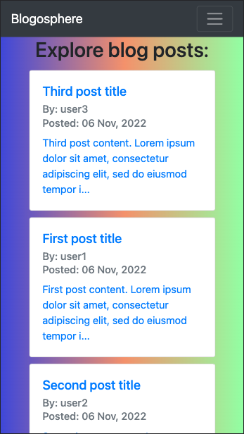

# Basic Blog Platform

 
Link to deployed page: https://lit-waters-47914.herokuapp.com/

## Description

A basic blog platform built on Handlebars, Express, Node, and Sequelize. Provides basic functionality for account creation, writing new posts, and attaching comments to posts.

## Table of Contents

- [Installation](#installation)
- [Usage](#usage)
- [Tests](#tests)
- [Contributing](#contributing)
- [Questions](#questions)
- [License](#license)

## Installation

Run "npm i" in the project directory. Edit .env.EXAMPLE to strip off the dummy suffix and add your database information. Run "npm run seed" after setting up the db schema (in db/schema) to seed the application with basic content.

## Usage

Run "npm server" to start the application. Navigate to localhost:3001 if being run locally. Deployed application can be found here as an example: https://lit-waters-47914.herokuapp.com/

## Tests

No tests implemented at this time.

## Contributing

Not accepting contributions at this time, but feel free to use and fork at your leisure.

## Questions

[Github: Gordon-Magill](https://github.com/Gordon-Magill) 
Email: gordon.magill@gmail.com
Please reach out via provided email for any questions.

## License

Licensed under [MIT](https://opensource.org/licenses/MIT).